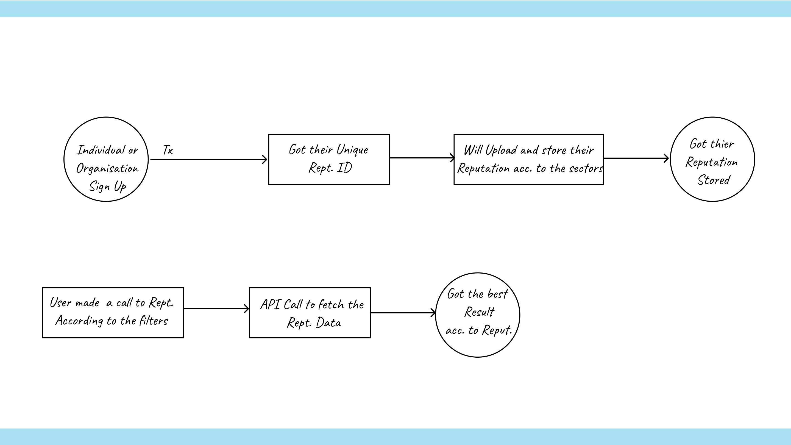

# Beckn-enabled Reputation Infrastructure

The Reputation Infrastructure is a application that will shape the new form of rating or reputation where the reputation will be dependent on both qualitative and quantitative attributes present in the sectors that will help them to build a transparent reputation for the organization or an individual. User can search for them by applying filters based upon different attributes. 
 
 
It includes  Core Reputation by summing up various sectors that can provide reputation to any sectors/ individuals, people can upload their Reputation, which will be stored in their unique Rept. ID which can be accessible easily and people can see and showcase their reputation.
 
 
Its built to make a transparent and effective reputation for an organization or an individual , to provide a transparent infrastructure for the conventional rating system. It will help users to search the particular service or organization based on the attributes they need the most, by fetching the data from the reputation. 
 
 
It can be helpful to authenticate the Reputation/Rating sectors by verifying the reputation, or that vague reputation and rating system by introducing transparency and trust. Users would be able to get the service which they desire the most.

## Why Reputation Infrastructure?
Reputation/Rating plays a crucial role, and are essential in the service industries to build trust between provider and customer and helps customer to make good-decision. Reputation or Rating system is almost used by every service providing companies like Amazon, Zomato, Flipkart, Urban Company and etc. Many use the rating system to get the feedback on their employee behavior, delivery partners and so on. So, that they can use the feedback ratings to improve the overall product quality and services to deliver the best services to their customers.
 
Whenever we select any product we see its ratings and customer feedback before buying it or whenever we select any service from choosing a Restaurant, Hotel, Salon or any other service we still rely on the ratings or the customer feedback before making a choice to make a good decision.
 
The current reputation and rating infrastructure faces several challenge like Overreliance on Numeric Ratings, Interdependency Challenges, Lack of Verification, Sample Bias and Competitor Manipulation.
 
To tackle the above stated challenges and to have a fair and trustworthy Reputation System, in this project we will be working on a decentralized and beckn-enabled reputation system, that will provide <b>Trust and Transparency</b>, <b> User Control and Ownership</b>, <b>Resilience and Security</b>, <b>Interoperability and Portability</b>, and <b>Enhanced Fairness and Accountability</b>.

## Features 
- Users would be able to search for the service or organisation by using the filter attributes which they need the most and will get the best results according to reputation.

- Transparent, Decentralized and Trustworthy Reputation for an individual or an orhanisation.

- Enhanced UI and unique Rept. ID where the reputation will be stored according to the sectors.

## How it Works?

## Getting Started 

To get started with Reputation Infrastructre, follow the folowing steps: 

1. Clone the repository into the terminal: `git clone https://github.com/beckn/reputation-infra`.

2. Install the required dependencies by running the command `npm install`.

3. Can start the local server and the application by running `npm run dev`.

4. Hence, the project got set-up into your local machine and can contribute towards it.

## Documentation 

The documentation of the project : https://www.figma.com/file/Q2AA6LHVbw251Ki2EIMhud/Beckn-Reputation-Infrastructure?type=design&node-id=8%3A95&mode=design&t=BsWvytTznuw9eypB-1

## Contribution Guide 

We welcome contributions(bugs, new requested features and enhanced UIs) to the application, please follow the below steps to start the contribution towards it: 

1. Fork the repository. 

2. Clone the repository into your local setup by running the command `git clone https://github.com/beckn/reputation-infra`.

3. Install the required dependencies by running the command `npm install`.

4. Can start the local server and the application by running `npm run dev`.

5. Create the issue for the bug fix and the feature request with the tag in issues section of the repo, start working on it.

6. Create a new branch for your bug fix or feature: `git checkout -b new-branch`.

7. Make your desired changes and commit them: `git commit -m "Requested feature"`.

8. Push the commit to the forked repo by using: `git push origin new-branch`

9. Create a Pull Request(PR) by mentionning the issue in it to the main repository.